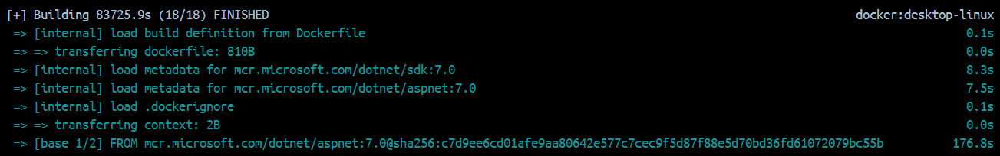
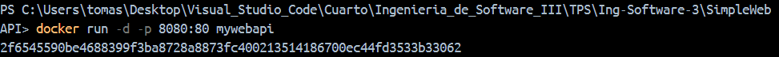

# 4- Desarrollo:

## 1- Instalar Docker Community Edition 
  - Diferentes opciones para cada sistema operativo
  - https://docs.docker.com/
  - Ejecutar el siguiente comando para comprobar versiones de cliente y demonio.
```bash
docker version
```


## 2- Explorar DockerHub
   - Registrase en docker hub: https://hub.docker.com/
   - Familiarizarse con el portal


## 3- Obtener la imagen BusyBox
  - Ejecutar el siguiente comando, para bajar una imagen de DockerHub
  ```bash
  docker pull busybox
  ```
  - Verificar qué versión y tamaño tiene la imagen bajada, obtener una lista de imágenes locales:
```bash
docker images
```


## 4- Ejecutando contenedores
  - Ejecutar un contenedor utilizando el comando **run** de docker:
```bash
docker run busybox
```


  - Explicar porque no se obtuvo ningún resultado: Al ejecutar este comando, se está iniciando un contenedor a partir de la imagen busybox. Sin embargo, no se especifica ningún comando a ejecutar dentro del contenedor. Esto significa que Docker ejecuta el contenedor, pero como no hay un proceso en ejecución, el contenedor se detiene inmediatamente después de iniciarse. Por eso, no se obtiene ningún resultado visible.

  - Especificamos algún comando a correr dentro del contenedor, ejecutar por ejemplo:
```bash
docker run busybox echo "Hola Mundo"
```


  - Ver los contenedores ejecutados utilizando el comando **ps**:
```bash
docker ps
```


  - Vemos que no existe nada en ejecución, correr entonces:
```bash
docker ps -a
```


  - Mostrar el resultado y explicar que se obtuvo como salida del comando anterior: Este comando lista todos los contenedores que han sido creados, independientemente de si están en ejecución o no.

## 5- Ejecutando en modo interactivo
  - Ejecutar el siguiente comando
```bash
docker run -it busybox sh
```


  - Para cada uno de los siguientes comandos dentro de contenedor, mostrar los resultados:
```bash
ps
uptime
free
ls -l /
```


  - Salimos del contenedor con:
```bash
exit
```

## 6- Borrando contenedores terminados
  - Obtener la lista de contenedores 
```bash
docker ps -a
```
  - Para borrar podemos utilizar el id o el nombre (autogenerado si no se especifica) de contenedor que se desee, por ejemplo:
```bash
docker rm elated_lalande
```


  - Para borrar todos los contenedores que no estén corriendo, ejecutar cualquiera de los siguientes comandos:
```bash
docker rm $(docker ps -a -q -f status=exited)
```
```bash
docker container prune
```


## 7- Construir una imagen
- Conceptos de DockerFile
  - Leer https://docs.docker.com/engine/reference/builder/ 
  - Describir las instrucciones
     - FROM: Define la imagen base que se utilizará para construir la nueva imagen. Es el primer comando en un Dockerfile.
     - RUN: Ejecuta un comando en la imagen durante la construcción. Es utilizado para instalar paquetes, copiar archivos, etc.
     - ADD: Copia archivos/directorios desde el host al sistema de archivos del contenedor. Además, puede descomprimir archivos tar
     - COPY: Similar a ADD, pero solo copia archivos o directorios, sin la capacidad de descomprimir.
     - EXPOSE: Informa sobre el puerto en el que el contenedor escuchará durante su ejecución. Esto no publica el puerto.
     - CMD: Especifica un comando por defecto que se ejecutará cuando el contenedor se inicie. Solo puede haber una instrucción CMD.
     - ENTRYPOINT: Similar a CMD, pero no puede ser sobrescrito desde la línea de comandos. Utilizado para establecer el comando   principal a ejecutar.

- A partir del código https://github.com/ingsoft3ucc/SimpleWebAPI crearemos una imagen.
- Clonar repo
- Crear imagen etiquetándola con un nombre. El punto final le indica a Docker que use el dir actual
```
docker build -t mywebapi .
```



- Revisar Dockerfile y explicar cada línea:
    - FROM mcr.microsoft.com/dotnet/aspnet:7.0 AS base
    Esta línea define la imagen base para la ejecución de la aplicación. Está utilizando la imagen de ASP.NET Core 7.0, que incluye todo lo necesario para ejecutar aplicaciones web ASP.NET. La etiqueta AS base permite darle un nombre a esta fase del proceso de construcción.

    - WORKDIR /app
    Establece el directorio de trabajo dentro del contenedor como /app, donde se colocarán los archivos de la aplicación.

    - EXPOSE 80
    - EXPOSE 443
    - EXPOSE 5254
    Estas líneas indican que el contenedor estará escuchando en los puertos 80 (HTTP), 443 (HTTPS) y 5254. Aunque esto no publica los puertos automáticamente, es una forma de documentar qué puertos están en uso.

    - FROM mcr.microsoft.com/dotnet/sdk:7.0 AS build
    Esta línea inicia una nueva fase del proceso de construcción, utilizando la imagen SDK de .NET 7.0 para compilar la aplicación. El SDK incluye herramientas para compilar y desarrollar aplicaciones, en contraste con la imagen ASP.NET, que solo ejecuta la aplicación.

    - WORKDIR /src
    Cambia el directorio de trabajo al directorio /src, donde se colocarán los archivos fuente de la aplicación.

    - COPY ["SimpleWebAPI/SimpleWebAPI.csproj", "SimpleWebAPI/"]
    Copia el archivo de proyecto SimpleWebAPI.csproj al directorio dentro del contenedor. Esto permite instalar las dependencias especificadas en ese archivo.

    - RUN dotnet restore "SimpleWebAPI/SimpleWebAPI.csproj"
    Ejecuta el comando dotnet restore, que descarga todas las dependencias y paquetes NuGet necesarios para compilar la aplicación.

    - COPY . .
    Copia todos los archivos del directorio de trabajo en tu máquina local al contenedor. Esto incluye el código fuente de la aplicación.

    - WORKDIR "/src/SimpleWebAPI"
    Cambia el directorio de trabajo al directorio específico de la aplicación dentro del contenedor.

    - RUN dotnet build "SimpleWebAPI.csproj" -c Release -o /app/build
    Compila el proyecto en modo "Release", lo que genera los binarios optimizados. Los archivos generados se colocan en el directorio /app/build.

    - FROM build AS publish
    Inicia una nueva fase llamada publish. Aquí se toma la imagen construida en la fase anterior (build), para optimizar y publicar los artefactos que se van a ejecutar.

    - RUN dotnet publish "SimpleWebAPI.csproj" -c Release -o /app/publish /p:UseAppHost=false
    Publica la aplicación con el comando dotnet publish, que crea una versión lista para producción en el directorio /app/publish. El parámetro /p:UseAppHost=false evita generar un archivo ejecutable específico del sistema operativo.

    - FROM base AS final
    Inicia la última fase llamada final, utilizando la imagen base definida al principio (base), que está optimizada para ejecutar la aplicación.

    - WORKDIR /app
    Vuelve a establecer el directorio de trabajo a /app, donde se copiarán los archivos publicados.

    - COPY --from=publish /app/publish .
    Copia los archivos publicados desde la fase publish al directorio de trabajo actual del contenedor.

    - ENTRYPOINT ["dotnet", "SimpleWebAPI.dll"]
    Define el punto de entrada del contenedor. Cuando el contenedor se ejecute, este comando ejecutará la aplicación con dotnet SimpleWebAPI.dll.

- Ver imágenes disponibles


- Ejecutar un contenedor con nuestra imagen



- Subir imagen a nuestra cuenta de dockerhub
  - 7.1 Inicia sesión en Docker Hub
    - Primero, asegúrate de estar autenticado en Docker Hub desde tu terminal:
    ```bash
    docker login
    ```


  - 7.2 Etiquetar la imagen a subir con tu nombre de usuario de Docker Hub y el nombre de la imagen. Por ejemplo:
    ```bash
    docker tag <nombre_imagen_local> <tu_usuario_dockerhub>/<nombre_imagen>:<tag>
    ```


  - 7.3 Subir la Imagen
    - Para subir la imagen etiquetada a Docker Hub, utiliza el comando docker push:
     ```bash
     docker push <tu_usuario_dockerhub>/<nombre_imagen>:<tag>
     ```


  - 7.4 Verificar la Subida
     ```bash
     docker pull <tu_usuario_dockerhub>/<nombre_imagen>:<tag>
     ```


## 8- Publicando puertos
En el caso de aplicaciones web o base de datos donde se interactúa con estas aplicaciones a través de un puerto al cual hay que acceder, estos puertos están visibles solo dentro del contenedor. Si queremos acceder desde el exterior deberemos exponerlos.

  - Ejecutar la siguiente imagen, en este caso utilizamos la bandera -d (detach) para que nos devuelva el control de la consola:

```bash
docker run --name myapi -d mywebapi
```
  - Ejecutamos un comando ps:


  - Vemos que el contendor expone 3 puertos el 80, el 5254 y el 443, pero si intentamos en un navegador acceder a http://localhost/WeatherForecast no sucede nada.


  - Procedemos entonces a parar y remover este contenedor:
```bash
docker kill myapi
docker rm myapi
```


  - Vamos a volver a correrlo otra vez, pero publicando el puerto 80

```bash
docker run --name myapi -d -p 80:80 mywebapi
```


  - Accedamos nuevamente a http://localhost/WeatherForecast y vemos que nos devuelve datos.


## 9- Modificar Dockerfile para soportar bash 
- Modificamos dockerfile para que entre en bash sin ejecutar automaticamente la app

```bash
#ENTRYPOINT ["dotnet", "SimpleWebAPI.dll"]
CMD ["/bin/bash"]
```
- Rehacemos la imagen
```
docker build -t mywebapi .
```


- Corremos contenedor en modo interactivo exponiendo puerto
```
docker run -it --rm -p 80:80 mywebapi
```


- Navegamos a http://localhost/weatherforecast
- Vemos que no se ejecuta automaticamente


- Ejecutamos app:
```
dotnet SimpleWebAPI.dll
```


-Volvemos a navegar a http://localhost/weatherforecast


- Salimos del contenedor

## 10- Montando volúmenes
Hasta este punto los contenedores ejecutados no tenían contacto con el exterior, ellos corrían en su propio entorno hasta que terminaran su ejecución. Ahora veremos cómo montar un volumen dentro del contenedor para visualizar por ejemplo archivos del sistema huésped:

  - Ejecutar el siguiente comando, cambiar myusuario por el usuario que corresponda. En Mac puede utilizarse /Users/miusuario/temp):
```bash
docker run -it --rm -p 80:80 -v /Users/miuser/temp:/var/temp  mywebapi
```


  - Dentro del contenedor correr
```bash
ls -l /var/temp
touch /var/temp/hola.txt
```


  - Verificar que el Archivo se ha creado en el directorio del guest y del host.


## 11- Utilizando una base de datos
- Levantar una base de datos PostgreSQL

```bash
mkdir $HOME/.postgres

docker run --name my-postgres -e POSTGRES_PASSWORD=mysecretpassword -v $HOME/.postgres:/var/lib/postgresql/data -p 5432:5432 -d postgres:9.4
```


- Ejecutar sentencias utilizando esta instancia

```bash
docker exec -it my-postgres /bin/bash

psql -h localhost -U postgres

#Estos comandos se corren una vez conectados a la base

\l
create database test;
\connect test
create table tabla_a (mensaje varchar(50));
insert into tabla_a (mensaje) values('Hola mundo!');
select * from tabla_a;

\q

exit
```


- Conectarse a la base utilizando alguna IDE (Dbeaver - https://dbeaver.io/, Azure DataStudio -https://azure.microsoft.com/es-es/products/data-studio, etc). Interactuar con los objectos objectos creados.


- Explicar que se logro con el comando `docker run` y `docker exec` ejecutados en este ejercicio.
  - Con el comando docker run, se levantó un contenedor que ejecuta una base de datos PostgreSQL, exponiendo el puerto 5432 y montando un volumen persistente en tu máquina local. Luego, con docker exec, accediste a ese contenedor en ejecución para interactuar con la base de datos desde la línea de comandos, lo que te permitió crear y manipular datos.

## 12- Hacer el punto 11 con Microsoft SQL Server
- Armar un contenedor con SQL Server
- Crear BD, Tablas y ejecutar SELECT

- Paso 1: Levantar un contenedor con SQL Server 2022:
```bash
docker run -e "ACCEPT_EULA=Y" -e "SA_PASSWORD=MyStrongPassword123" -p 1433:1433 --name sqlserver2022 -d mcr.microsoft.com/mssql/server:2022-latest
```


- Paso 2: Conectarse a SQL Server 2022 desde Azure Data Studio:


- Paso 3: Ejecutar sentencias SQL:
```bash
CREATE DATABASE TestDB;USE TestDB;
CREATE TABLE TablaA (
    Mensaje VARCHAR(50)
);
INSERT INTO TablaA (Mensaje) VALUES ('Hola mundo!');

SELECT * FROM TablaA;
```


