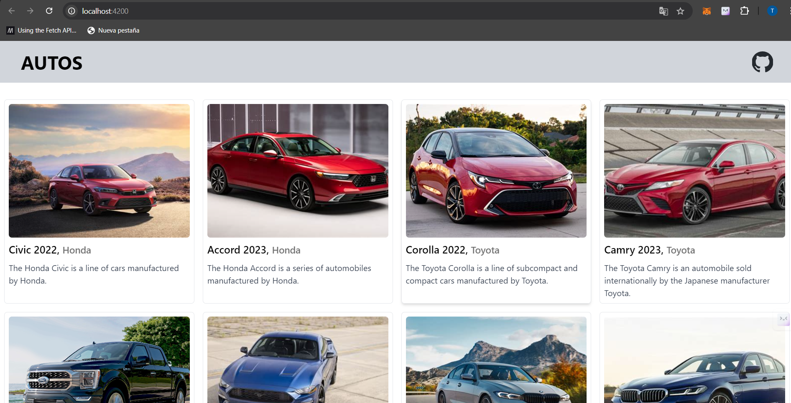

# 3- Consignas a desarrollar en el trabajo práctico:

 **Azure DevOps Pipelines**
  - Breve descripción de Azure DevOps Pipelines: Es una herramienta para automatizar la integración continua (CI) y la entrega continua (CD), permitiendo compilar, probar y desplegar aplicaciones de forma eficiente.
  - Tipos de Pipelines:
    - Build Pipelines: Compilan el código, ejecutan pruebas y generan artefactos para el despliegue.
    - Deploy Pipelines: Despliegan los artefactos en diferentes entornos, como desarrollo o producción.
  - Diferencias entre editor clásico y YAML:
    - Editor clásico: Usa una interfaz gráfica para configurar pipelines sin necesidad de codificación.
    - YAML: Define pipelines mediante código, ofreciendo mayor flexibilidad y control.
  - Agentes MS y Self-Hosted:
    - Agentes MS: Gestionados por Azure, simplifican la configuración y mantenimiento.
    - Agentes Self-Hosted: Gestionados por la organización, ofrecen más control, pero requieren más esfuerzo de mantenimiento.

## 4- Pasos del TP
 - 4.1 Verificar acceso a Pipelines concedido

 - 4.2 Agregar en pipeline YAML una tarea de Publish.

 - 4.3 Explicar por qué es necesario contar con una tarea de Publish en un pipeline que corre en un agente de Microsoft en la nube.
    -  En un pipeline que corre en un agente de Microsoft en la nube, es necesario incluir una tarea de Publish para asegurar que los artefactos generados (como binarios, paquetes, archivos de configuración, etc.) sean almacenados y accesibles fuera del entorno temporal del agente.

 - 4.4 Descargar el resultado del pipeline y correr localmente el software compilado.

 - 4.5 Habilitar el editor clásico de pipelines. Explicar las diferencias claves entre este tipo de editor y el editor YAML:
    - Editor clásico: Usa una interfaz gráfica para configurar pipelines sin necesidad de codificación.
    - YAML: Define pipelines mediante código, ofreciendo mayor flexibilidad y control.

 - 4.6 Crear un nuevo pipeline con el editor clásico. Descargar el resultado del pipeline y correr localmente el software compilado.

 - 4.7 Configurar CI en ambos pipelines (YAML y Classic Editor). Mostrar resultados de la ejecución automática de ambos pipelines al hacer un commit en la rama main.

 - 4.8 Explicar la diferencia entre un agente MS y un agente Self-Hosted. Qué ventajas y desventajas hay entre ambos? Cuándo es conveniente y/o necesario usar un Self-Hosted Agent?
    - Diferencias entre Agente MS y Agente Self-Hosted
      - Agente MS: Proporcionado y gestionado por Microsoft, fácil de usar, siempre actualizado, pero con limitaciones de recursos y software.
      - Agente Self-Hosted: Gestionado por la organización, ofrece control total y personalización, pero requiere mantenimiento y costos de infraestructura.

    - Ventajas y Desventajas
    - Agente MS:
      - Ventajas: Simplicidad, escalabilidad, sin mantenimiento.
      - Desventajas: Limitaciones de recursos, posibles costos, falta de software específico.
    - Agente Self-Hosted:
      - Ventajas: Control total, sin restricciones de tiempo, personalización.
      - Desventajas: Requiere mantenimiento, infraestructura propia, responsabilidad de seguridad.
  
    - Cuándo Usar un Agente Self-Hosted?
      - Cuando necesitas software personalizado, tareas que consumen muchos recursos, alta seguridad, o integración con infraestructura local.
    
 - 4.8 Crear un Pool de Agentes y un Agente Self-Hosted

 
 - 4.9 Instalar y correr un agente en nuestra máquina local.
 - 4.10 Crear un pipeline que use el agente Self-Hosted alojado en nuestra máquina local.

 - 4.11 Buscar el resultado del pipeline y correr localmente el software compilado.

 - 4.12 Crear un nuevo proyecto en ADO clonado desde un repo que contenga una aplicación en Angular como por ejemplo https://github.com/ingsoft3ucc/angular-demo-project.git

 - 4.13 Configurar un pipeline de build para un proyecto de tipo Angular como el clonado.

 - 4.14 Habilitar CI para el pipeline.

 - 4.15 Hacer un cambio a un archivo del proyecto (algún cambio en el HTML que se renderiza por ejemplo) y verificar que se ejecute automáticamente el pipeline.

 - 4.16 Descargar el resultado del pipeline y correr en un servidor web local el sitio construido.

 - 4.17 Mostrar el antes y el después del cambio.

