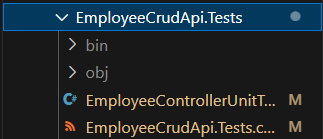
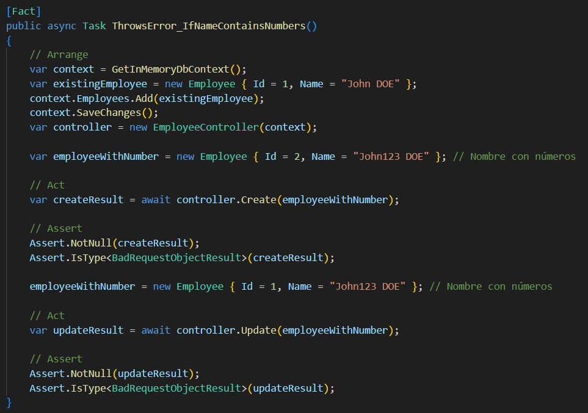
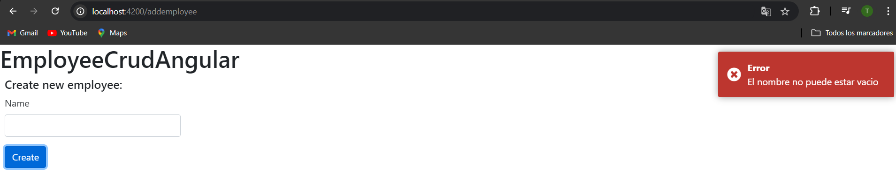

# Trabajo Práctico 6 - Pruebas Unitarias
## 4- Desarrollo:
### 4.1 Creación de una BD SQL Server para nuestra App
A\. Crear una BD Azure SQL Database (Ver Instructivo 5.1) o montar una imagen Docker de SQL Server como se solicitó en el punto 12 del [TP02]. (https://github.com/ingsoft3ucc/TPS_2024/blob/main/trabajos/02-introduccion-docker.md)


B\. En caso de optar por la opción de montar la imagen de docker, una vez levantada el contenedor, conectarse y ejecutar el siguiente script:
```sql

SET ANSI_NULLS ON
GO
SET QUOTED_IDENTIFIER ON
GO
CREATE TABLE [dbo].[Employees](
	[Id] [int] IDENTITY(1,1) NOT NULL,
	[Name] [nvarchar](max) NULL,
	[CreatedDate] [datetime2](7) NOT NULL,
 CONSTRAINT [PK_Employees] PRIMARY KEY CLUSTERED 
(
	[Id] ASC
)WITH (STATISTICS_NORECOMPUTE = OFF, IGNORE_DUP_KEY = OFF, OPTIMIZE_FOR_SEQUENTIAL_KEY = OFF) ON [PRIMARY]
) ON [PRIMARY] TEXTIMAGE_ON [PRIMARY]
GO
SET IDENTITY_INSERT [dbo].[Employees] ON 
GO
INSERT [dbo].[Employees] ([Id], [Name], [CreatedDate]) VALUES (1, N'Juan Perez', CAST(N'2024-09-05T00:00:00.0000000' AS DateTime2))
GO
INSERT [dbo].[Employees] ([Id], [Name], [CreatedDate]) VALUES (2, N'Carla Ruiz', CAST(N'2024-09-05T22:22:47.4405720' AS DateTime2))
GO
INSERT [dbo].[Employees] ([Id], [Name], [CreatedDate]) VALUES (3, N'Carlos Gomez', CAST(N'2024-09-06T09:16:50.0709430' AS DateTime2))
GO
INSERT [dbo].[Employees] ([Id], [Name], [CreatedDate]) VALUES (4, N'Joaquin Zarate', CAST(N'2024-09-06T09:19:37.8987160' AS DateTime2))
GO
INSERT [dbo].[Employees] ([Id], [Name], [CreatedDate]) VALUES (5, N'Luis Rodriguez', CAST(N'2024-09-06T09:23:31.3244340' AS DateTime2))
GO
SET IDENTITY_INSERT [dbo].[Employees] OFF
GO
```


### 4.2 Obtener nuestra App
A\. Clonar el repo https://github.com/ingsoft3ucc/Angular_WebAPINetCore8_CRUD_Sample.git

B\. Seguir las instrucciones del README.md del repo clonado prestando atención a la modificación de la cadena de conexión en el appSettings.json para que apunte a la BD creada en 4.1 

C\. Navegar a http://localhost:7150/swagger/index.html y probar uno de los controladores para verificar el correcto funcionamiento de la API.


D\. Navegar a http://localhost:4200 y verificar el correcto funcionamiento de nuestro front-end Angular


E\. Una vez verificado el correcto funcionamiento de la Aplicación procederemos a crear un proyecto de pruebas unitarias para nuestra API.

### 4.3 Crear Pruebas Unitarias para nuestra API
A\. En el directorio raiz de nuestro repo crear un nuevo proyecto de pruebas unitarias para nuestra API 
```bash
dotnet new xunit -n EmployeeCrudApi.Tests
```

B\. Instalar dependencias necesarias

Primero, instala las siguientes bibliotecas mediante NuGet:

- **Moq**
- **xUnit** 
- **Microsoft.EntityFrameworkCore.InMemory**

```bash
cd EmployeeCrudApi.Tests 
dotnet add package Moq
dotnet add package xunit
dotnet add package Microsoft.EntityFrameworkCore.InMemory

```

C\. Editar archivo UnitTest1.cs reemplazando su contenido por
```csharp
using EmployeeCrudApi.Controllers;
using EmployeeCrudApi.Data;
using EmployeeCrudApi.Models;
using Microsoft.EntityFrameworkCore;
using System;
using System.Collections.Generic;
using System.Threading.Tasks;
using Xunit;

namespace EmployeeCrudApi.Tests
{
    public class EmployeeControllerTests
    {
        private ApplicationDbContext GetInMemoryDbContext()
        {
            var options = new DbContextOptionsBuilder<ApplicationDbContext>()
                .UseInMemoryDatabase(databaseName: Guid.NewGuid().ToString()) // Crear una nueva base de datos en memoria para cada prueba
                .Options;

            return new ApplicationDbContext(options);
        }

        [Fact]
        public async Task GetAll_ReturnsListOfEmployees()
        {
            // Arrange
            var context = GetInMemoryDbContext();
            context.Employees.AddRange(
                new Employee { Id = 1, Name = "John Doe" },
                new Employee { Id = 2, Name = "Jane Doe" }
            );
            context.SaveChanges();

            var controller = new EmployeeController(context);

            // Act
            var result = await controller.GetAll();

            // Assert
            Assert.Equal(2, result.Count);
            Assert.Equal("John Doe", result[0].Name);
            Assert.Equal("Jane Doe", result[1].Name);
        }

        [Fact]
        public async Task GetById_ReturnsEmployeeById()
        {
            // Arrange
            var context = GetInMemoryDbContext();
            context.Employees.Add(new Employee { Id = 1, Name = "John Doe" });
            context.SaveChanges();

            var controller = new EmployeeController(context);

            // Act
            var result = await controller.GetById(1);

            // Assert
            Assert.NotNull(result);
            Assert.Equal(1, result.Id);
            Assert.Equal("John Doe", result.Name);
        }

        [Fact]
        public async Task Create_AddsEmployee()
        {
            // Arrange
            var context = GetInMemoryDbContext();
            var controller = new EmployeeController(context);

            var newEmployee = new Employee { Id = 3, Name = "New Employee" };

            // Act
            await controller.Create(newEmployee);

            // Assert
            var employee = await context.Employees.FindAsync(3);
            Assert.NotNull(employee);
            Assert.Equal("New Employee", employee.Name);
        }

        [Fact]
        public async Task Update_UpdatesEmployee()
        {
            // Arrange
            var context = GetInMemoryDbContext();
            var existingEmployee = new Employee { Id = 1, Name = "Old Name" };
            context.Employees.Add(existingEmployee);
            context.SaveChanges();

            var controller = new EmployeeController(context);

            var updatedEmployee = new Employee { Id = 1, Name = "Updated Name" };

            // Act
            await controller.Update(updatedEmployee);

            // Assert
            var employee = await context.Employees.FindAsync(1);
            Assert.NotNull(employee);
            Assert.Equal("Updated Name", employee.Name);
        }

        [Fact]
        public async Task Delete_RemovesEmployee()
        {
            // Arrange
            var context = GetInMemoryDbContext();
            var employeeToDelete = new Employee { Id = 1, Name = "John Doe" };
            context.Employees.Add(employeeToDelete);
            context.SaveChanges();

            var controller = new EmployeeController(context);

            // Act
            await controller.Delete(1);

            // Assert
            var employee = await context.Employees.FindAsync(1);
            Assert.Null(employee); // Verifica que el empleado fue eliminado
        }
    }
}

```



D\. Renombrar archivo UnitTest1.cs por EmployeeControllerUnitTests.cs
```bash
mv UnitTest1.cs EmployeeControllerUnitTests.cs 
```

E\. Editar el archivo EmployeeCrudApi.Tests/EmployeeCrudApi.Tests.csproj para agregar una referencia a nuestro proyecto de EmployeeCrudApi reemplazando su contenido por
```xml
<Project Sdk="Microsoft.NET.Sdk">

  <PropertyGroup>
    <TargetFramework>net8.0</TargetFramework>
    <ImplicitUsings>enable</ImplicitUsings>
    <Nullable>enable</Nullable>

    <IsPackable>false</IsPackable>
    <IsTestProject>true</IsTestProject>
  </PropertyGroup>

  <ItemGroup>
    <PackageReference Include="coverlet.collector" Version="6.0.0" />
    <PackageReference Include="Microsoft.EntityFrameworkCore.InMemory" Version="8.0.8" />
    <PackageReference Include="Microsoft.NET.Test.Sdk" Version="17.8.0" />
    <PackageReference Include="Moq" Version="4.20.71" />
    <PackageReference Include="xunit" Version="2.9.0" />
    <PackageReference Include="xunit.runner.visualstudio" Version="2.5.3" />
  </ItemGroup>

  <ItemGroup>
    <ProjectReference Include="../EmployeeCrudApi/EmployeeCrudApi/EmployeeCrudApi.csproj" />
  </ItemGroup>

  <ItemGroup>
    <Using Include="Xunit" />
  </ItemGroup>

</Project>

```
F\. Ejecutar los siguientes comandos para ejecutar nuestras pruebas
```bash
dotnet build
dotnet test
```
G\. Verificar que se hayan ejecutado correctamente las pruebas


H\. Verificar que no estamos usando una dependencia externa como la base de datos.

I\. Modificar la cadena de conexión en el archivo appsettings.json para que use un usuario o password incorrecto y recompilar el proyecto EmployeeCrudApi
```bash
dotnet build
dotnet run --urls "http://localhost:7150"
```


J\. Verificar que nuestro proyecto ya no tiene acceso a la BD navegando a http://localhost:7150/swagger/index.html y probando uno de los controladores:


K\. En la carpeta de nuestro proyecto EmployeeCrudApi.Tests volver a correr las pruebas
```bash
dotnet build
dotnet test
```

L\. Verificar que se hayan ejecutado correctamente las pruebas inclusive sin tener acceso a la BD, lo que confirma que es efectivamente un conjunto de pruebas unitarias que no requieren de una dependencia externa para funcionar.


M\. Modificar la cadena de conexión en el archivo appsettings.json para que use el usuario y password correcto y recompilar el proyecto EmployeeCrudApi
```bash
dotnet build
dotnet run --urls "http://localhost:7150"
```
N\. Verificar que nuestro proyecto vuelve a tener acceso a la BD navegando a http://localhost:7150/swagger/index.html y probando uno de los controladores:


### 4.4 Creamos pruebas unitarias para nuestro front de Angular:
Intro\. 
Para las pruebas unitarias de nuestro front en Angular utilizaremos Jasmine y Karma, herramientas ampliamente utilizadas para pruebas unitarias en aplicaciones web, especialmente en proyectos de Angular.

- **Jasmine**
- **Karma**

A\. Nos posicionamos en nuestro proyecto de front, en el directorio EmployeeCrudAngular/src/app
```bash
pwd
```

B\. Editamos el archivo app.component.spec.ts reemplazando su contenido por:
```typescript
import { TestBed } from '@angular/core/testing';
import { AppComponent } from './app.component'; // Ajusta la ruta si es necesario

describe('AppComponent', () => {
  beforeEach(async () => {
    await TestBed.configureTestingModule({
      imports: [AppComponent], // Usa imports en lugar de declarations
    }).compileComponents();
  });

  it('should render title', () => {
    const fixture = TestBed.createComponent(AppComponent);
    fixture.detectChanges();
    const compiled = fixture.nativeElement as HTMLElement;
    expect(compiled.querySelector('h1')?.textContent).toContain('EmployeeCrudAngular');
  });

});
```

C\. Creamos el archivo employee.service.spec.ts reemplazando su contenido por:
```typescript
import { TestBed } from '@angular/core/testing';
import { HttpClientTestingModule, HttpTestingController } from '@angular/common/http/testing';
import { EmployeeService } from './employee.service';
import { Employee } from './employee.model';
import { DatePipe } from '@angular/common';

describe('EmployeeService', () => {
  let service: EmployeeService;
  let httpMock: HttpTestingController;
  let datePipe: DatePipe;

  beforeEach(() => {
    TestBed.configureTestingModule({
      imports: [HttpClientTestingModule],
      providers: [
        EmployeeService,
        DatePipe
      ]
    });

    service = TestBed.inject(EmployeeService);
    httpMock = TestBed.inject(HttpTestingController);
    datePipe = TestBed.inject(DatePipe);
  });

  afterEach(() => {
    httpMock.verify();
  });

  it('should retrieve all employees', () => {
    const today = new Date();
    const expectedDateTime = datePipe.transform(today, 'dd/MM/yyyy HH:mm:ss', undefined) ?? '';  // Consistente con el servicio

    const dummyEmployees: Employee[] = [
      new Employee(1, 'John Doe', expectedDateTime),
      new Employee(2, 'Jane Smith', expectedDateTime)
    ];

    service.getAllEmployee().subscribe(employees => {
      expect(employees.length).toBe(2);
      employees.forEach((employee, index) => {
        // Agrega depuración aquí
        console.log('Employee createdDate:', datePipe.transform(employee.createdDate, 'dd/MM/yyyy HH:mm:ss', undefined)?? '');  // Imprimir el valor generado por el servicio
        console.log('Dummy employee createdDate:', datePipe.transform(dummyEmployees[index].createdDate, 'MM/dd/yyyy HH:mm:ss', undefined)?? '');   // Imprimir el valor esperado

        expect(datePipe.transform(employee.createdDate, 'dd/MM/yyyy HH:mm:ss', undefined)?? '').toEqual(datePipe.transform(dummyEmployees[index].createdDate, 'MM/dd/yyyy HH:mm:ss', undefined)?? '');  // Compara la fecha completa
      });
    });

    const req = httpMock.expectOne(`${service.apiUrlEmployee}/getall`);
    expect(req.request.method).toBe('GET');
    req.flush(dummyEmployees);
  });
});
```

D\. Editamos el archivo employee.component.spec.ts ubicado en la carpeta **employee** reemplazando su contenido por:

```typescript
import { TestBed } from '@angular/core/testing';
import { EmployeeComponent } from './employee.component';
import { HttpClientTestingModule } from '@angular/common/http/testing';
import { DatePipe } from '@angular/common';

describe('EmployeeComponent', () => {
  beforeEach(() => {
    TestBed.configureTestingModule({
      imports: [EmployeeComponent, HttpClientTestingModule],
      providers: [DatePipe] // Añade DatePipe a los proveedores
    });
  });

  it('should create', () => {
    const fixture = TestBed.createComponent(EmployeeComponent);
    const component = fixture.componentInstance;
    expect(component).toBeTruthy();
  });
});
```

E\. Editamos el archivo addemployee.component.spec.ts ubicado en la carpeta **addemployee** reemplazando su contenido por:
```typescript
import { TestBed } from '@angular/core/testing';
import { AddemployeeComponent } from './addemployee.component';
import { HttpClientTestingModule } from '@angular/common/http/testing';
import { ActivatedRoute } from '@angular/router';
import { of } from 'rxjs'; // para simular observables
import { DatePipe } from '@angular/common';

describe('AddemployeeComponent', () => {
  beforeEach(() => {
    TestBed.configureTestingModule({
      imports: [AddemployeeComponent, HttpClientTestingModule],
      providers: [
        DatePipe,
        {
          provide: ActivatedRoute, // Simula ActivatedRoute
          useValue: {
            params: of({ id: 1 }) // simula el parámetro id en la URL
          }
        }
      ]
    });
  });

  it('should create', () => {
    const fixture = TestBed.createComponent(AddemployeeComponent);
    const component = fixture.componentInstance;
    expect(component).toBeTruthy();
  });
});
```


F\. En el directorio raiz de nuestro proyecto EmployeeCrudAngular ejecutamos el comando 
```bash
ng test
```


En proyectos de Angular, Jasmine se usa para escribir las pruebas, y Karma se encarga de ejecutarlas. Cuando ejecutamos el comando ng test, Karma se inicia, carga las pruebas escritas en Jasmine, y las ejecuta en un navegador.

G\. Vemos que se abre una ventana de Karma con Jasmine en la que nos indica que los tests se ejecutaron correctamente


H\. Vemos que los tests se ejecutaron correctamente:


I\. Verificamos que no esté corriendo nuestra API navegando a http://localhost:7150/swagger/index.html y recibiendo esta salida:


J\. Los puntos G y H nos indican que se han ejecutado correctamente las pruebas inclusive sin tener acceso a la API, lo que confirma que es efectivamente un conjunto de pruebas unitarias que no requieres de una dependencia externa para funcionar.

### 4.5 Agregamos generación de reporte XML de nuestras pruebas de front.
Para cuando integremos nuestras pruebas en un pipeline de Build, vamos a necesitar el resultado devuelto por nuestras pruebas para reportarlas junto a las pruebas de back que se reportan automaticamente.

Haremos los siguientes pasos para prepararnos:

A\. Instalamos dependencia karma-junit-reporter
```bash
npm install karma-junit-reporter --save-dev
```
B\. En el directorio raiz de nuestro proyecto (al mismo nivel que el archivo angular.json) creamos un archivo karma.conf.js con el siguiente contenido
```bash
module.exports = function (config) {
  config.set({
    frameworks: ['jasmine', '@angular-devkit/build-angular'],
    plugins: [
      require('karma-jasmine'),
      require('karma-chrome-launcher'),
      require('karma-junit-reporter'),
      require('@angular-devkit/build-angular/plugins/karma')
    ],
    reporters: ['progress', 'junit'],
    junitReporter: {
      outputDir: 'test-results',
      outputFile: 'test-results.xml',
      useBrowserName: false
    },
    port: 9876,
    colors: true,
    logLevel: config.LOG_INFO,
    autoWatch: true,
    browsers: ['ChromeHeadless'],
    singleRun: true,
    restartOnFileChange: true
  });
};
```


C\. Ejecutamos nuestros test de la siguiente manera:
```bash
ng test --karma-config=karma.conf.js --watch=false --browsers ChromeHeadless
```


D\. Verificamos que se creo un archivo test-result.xml en el directorio test-results que está al mismo nivel que el directorio src


### 4.6 Modificamos el código de nuestra API y creamos nuevas pruebas unitarias:

A\. Realizar al menos 5 de las siguientes modificaciones sugeridas al código de la API:
  - Al agregar y al editar un empleado, controlar que el nombre del empleado no esté repetido.
  - La longitud máxima del nombre y apellido del empleado debe ser de 100 caracteres.
  - Almacenar el nombre en la BD siempre con la primera letra de los nombres en Mayuscula y todo el apellido en Mayusculas. Ejemplo, si recibo juan carlos chamizo, se debe almacenar como Juan Carlos CHAMIZO.
  - Validar que el nombre tenga un número mínimo de caracteres, por ejemplo, al menos dos caracteres para evitar entradas inválidas como "A".
  - Verificar que el nombre no contenga números, ya que no es común en los nombres de empleados.
En todos los casos donde no se cumplan las condiciones, la API debe devolver un error de HTTP 400 Bad Request y un Json indicando el error, por ejemplo:
```json
{
  "status": 400,
  "error": "Bad Request",
  "message": "El nombre del empleado ya existe."
}
```


B\. Crear las pruebas unitarias necesarias para validar las modificaciones realizadas en el código





### 4.7 Modificamos el código de nuestro Front y creamos nuevas pruebas unitarias:

A\. Realizar en el código del front las mismas modificaciones hechas a la API.


B\. Las validaciones deben ser realizadas en el front sin llegar a la API, y deben ser mostradas en un toast como por ejemplo https://stackblitz.com/edit/angular12-toastr?file=src%2Fapp%2Fapp.component.ts o https://stackblitz.com/edit/angular-error-toast?file=src%2Fapp%2Fcore%2Frxjsops.ts




C\. Crear las pruebas unitarias necesarias en el front para validar las modificaciones realizadas en el código del front.


