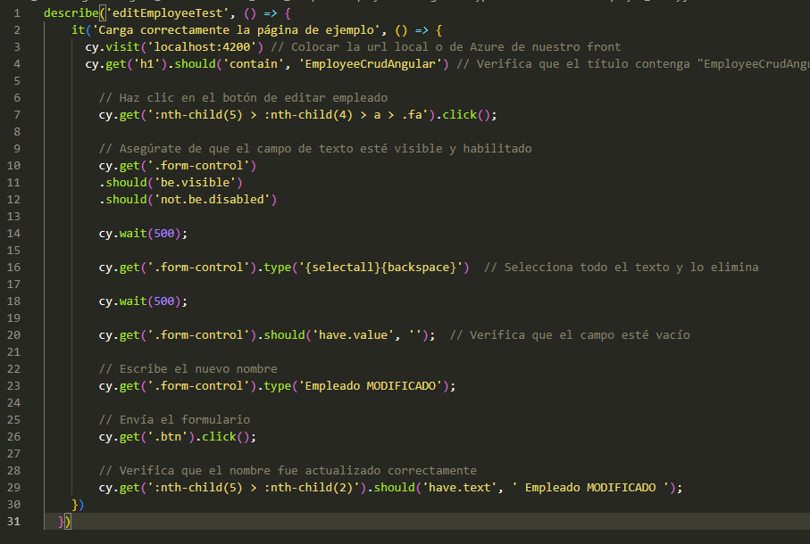
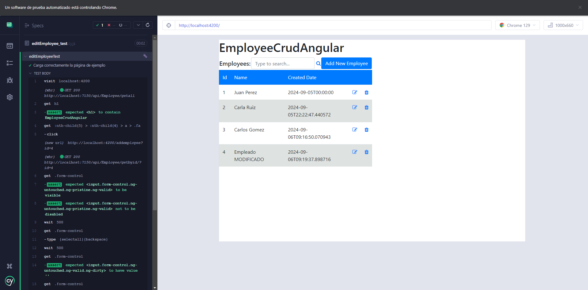
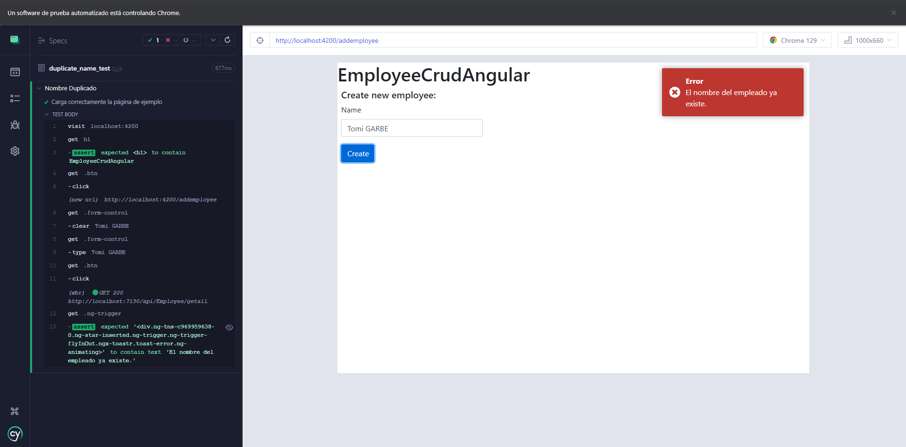

## Trabajo Práctico 7 - Code Coverage, Análisis estático de Código y Pruebas de Integración
### 4- Desarrollo:
#### 4.1 Agregar Code Coverage a nuestras pruebas unitarias de backend y front-end e integrarlas junto con sus resultados en nuestro pipeline de build.
- Desarrollo del punto 4.1: 
	- ##### 4.1.1 En el directorio raiz de nuestro proyecto Angular instalar el siguiente paquete:
  	```bash
	npm install karma-coverage --save-dev
   	```

   	- ##### 4.1.2 Editar nuestro archivo karma.conf.js para que incluya reporte de cobertura
  	```javascript
	module.exports = function (config) {
	  config.set({
	    frameworks: ['jasmine', '@angular-devkit/build-angular'],
	    plugins: [
	      require('karma-jasmine'),
	      require('karma-chrome-launcher'),
	      require('karma-junit-reporter'),
	      require('karma-coverage'),
	      require('@angular-devkit/build-angular/plugins/karma')
	    ],
	    reporters: ['progress', 'junit', 'coverage'],
	    junitReporter: {
	      outputDir: 'test-results',
	      outputFile: 'test-results.xml',
	      useBrowserName: false
	    },
	    coverageReporter: {
	      type: 'lcov',
	      dir: require('path').join(__dirname, './coverage'),
	      subdir: '.',
	      file: 'lcov.info'
	    },
	    preprocessors: {
	      // Añade los archivos que deseas instrumentar para la cobertura
	      'src/**/*.ts': ['coverage'], // Asegúrate de instrumentar los archivos de tu aplicación
	    },
	    port: 9876,
	    colors: true,
	    logLevel: config.LOG_INFO,
	    autoWatch: true,
	    browsers: ['ChromeHeadless'],
	    singleRun: true,
	    restartOnFileChange: true
	  });
	};
	```

	

   	- ##### 4.1.3 En el dir raiz del proyecto EmployeeCrudApi.Tests ejecutar:
   	  ```bash
   	  dotnet add package coverlet.collector
   	  ```
   	- ##### 4.1.4 Agregar a nuestro pipeline ANTES del Build de Back la tarea de test con los argumentos especificados y la de publicación de resultados de cobertura:
	```yaml
    - task: DotNetCoreCLI@2
      displayName: 'Ejecutar pruebas de la API'
      inputs:
        command: 'test'
        projects: '**/*.Tests.csproj'  # Asegúrate de que el patrón apunte a tu proyecto de pruebas
        arguments: '--collect:"XPlat Code Coverage"'

    - task: PublishCodeCoverageResults@2
      inputs:
        summaryFileLocation: '$(Agent.TempDirectory)/**/*.cobertura.xml'
        failIfCoverageEmpty: false
      displayName: 'Publicar resultados de code coverage del back-end'
	```

	

 	- ##### 4.1.5 Agregar a nuestro pipeline ANTES del Build de front la tarea de test y la de publicación de los resultados.
	   ```yaml
	    - script: npx ng test --karma-config=karma.conf.js --watch=false --browsers ChromeHeadless --code-coverage
	      displayName: 'Ejecutar pruebas del front'
	      workingDirectory: $(projectPath)
	      continueOnError: true  # Para que el pipeline continúe aunque falle
	    
	    - task: PublishCodeCoverageResults@2
	      inputs:
	        summaryFileLocation: '$(projectPath)/coverage/lcov.info'
	        failIfCoverageEmpty: false
	      condition: always()  # Esto asegura que se ejecute siempre
	      displayName: 'Publicar resultados de code coverage del front'  
	    
	    - task: PublishTestResults@2
	      inputs:
	        testResultsFormat: 'JUnit'
	        testResultsFiles: '$(projectPath)/test-results/test-results.xml'
	        failTaskOnFailedTests: true
	      condition: always()  # Esto asegura que se ejecute siempre
	      displayName: 'Publicar resultados de pruebas unitarias del front'
    	```

	
	
	- ##### 4.1.6 Ejecutar el pipeline y analizar el resultado de las pruebas unitarias y la cobertura de código.

 	
	


#### 4.2 Agregar Análisis Estático de Código con SonarCloud:
- Desarrollo del punto 4.2: Demostración de cómo integrar SonarCloud en un pipeline de CI/CD y cómo leer los reportes de análisis estático.
	- ##### 4.2.1 Integraremos SonarCloud para analizar el código fuente. Configurar SonarCloud en nuestro pipeline siguiendo instructivo 5.1
	  - Antes de nuestra tarea de Build del Back:
		```yaml
		    
	 	    - task: SonarCloudPrepare@2
		      inputs:
		        SonarCloud: 'SonarCloud' #Nombre de nuestra Service Connection a SonarCloud
		        organization: 'ingsoft3ucc'  #Nombre de nuestra organizacion SonarCloud
		        scannerMode: 'MSBuild'
		        projectKey: 'Angular_WebAPINetCore8_CRUD_Sample'  #Key de nuestro proyecto en SonarCloud
		        projectName: 'Angular_WebAPINetCore8_CRUD_Sample' #Nombre de nuestro proyecto en SonarCloud
		      displayName: 'Prepare SonarCloud'
	        
		 ```

  	  - Despues de nuestra tarea de Build del Back:
		   ```yaml
		     - task: SonarCloudAnalyze@2
		       inputs:
		         jdkversion: 'JAVA_HOME_17_X64'
		       displayName: 'Analyze SonarCloud'
		      
		    - task: SonarCloudPublish@2
		      displayName: 'Publish SonarCloud'
		      inputs:
		        pollingTimeoutSec: '300'
	    ```

		

  	- ##### 4.2.2 Vemos el resultado de nuestro pipeline, en extensions tenemos un link al análisis realizado por SonarCloud

  	
  
	- ##### 4.2.3 Ir al link y analizar toda la información obtenida. Detallar en la entrega del TP los puntos más relevantes del informe, qué significan y para qué sirven.
	- ###### En el informe de SonarCloud podemos ver los diferentes problemas que detecto en el código y los clasifica según severidad del problema (Alto, Medio o Bajo) y aspecto donde impacta mas el problema (mantenibilidad, fiabilidad o seguridad), además de esto nos dice en que parte del código esta el problema y cuanto tiempo llevaría arreglar el problema

  	
	


#### 4.3 Pruebas de Integración con Cypress:
- Desarrollo del punto 4.3: 
	- ##### 4.3.1 En el directorio raiz de nuestro proyecto Angular instalar el siguiente paquete:
  	```bash
	npm install cypress --save-dev
   	```
   	- ##### 4.3.2 Abrir Cypress:
  	```bash
   	npx cypress open
   	```

	

	- ##### 4.3.3 Inicializar Cypress en nuestro proyecto como se indica en el instructivo 5.2
   	Esto creará automáticamente una estructura de carpetas dentro de tu proyecto. 
	 - cypress/e2e: Aquí es donde se almacenan tus archivos de prueba.
	 - cypress/fixtures: Aquí se almacenan los datos de prueba que puedes usar en tus tests.
	 - cypress/support: Contiene archivos de configuración y comandos personalizados.

	 

  	- ##### 4.3.4 Crear nuestra primera prueba navegando a nuestro front.
 	En la carpeta cypress/e2e, crear un archivo con el nombre primer_test.js y agregar el siguiente código para probar la página de inicio de nuestro front:
  	```js
	  describe('Mi primera prueba', () => {
	  it('Carga correctamente la página de ejemplo', () => {
	    cy.visit('https://as-crud-web-api-qa.azurewebsites.net/') // Colocar la url local o de Azure de nuestro front
	    cy.get('h1').should('contain', 'EmployeeCrudAngular') // Verifica que el título contenga "EmployeeCrudAngular"
	  })
	})
   	```

	

	- ##### 4.3.5 Correr nuestra primera prueba
 	Si está abierta la interfaz gráfica de Cypress, aparecerá el archivo primer_test.cy.js en la lista de pruebas. Clic en el archivo para ejecutar la prueba.
  	
	
	
	También es posible ejecutar Cypress en modo "headless" (sin interfaz gráfica) utilizando el siguiente comando:
	```bash
 	npx cypress run
	```

	

	- ##### 4.3.6 Modificar nuestra prueba para que falle.
		- Editamos el archivo primer_test.cy.js y hacemos que espere otra cosa en el título
	  - Ejecutamos cypress en modo headless
	
	
	

	Cypress captura automáticamente pantallas cuando una prueba falla. Las capturas de pantalla se guardan en la carpeta `cypress/screenshots`.
	
	

 	- ##### 4.3.7 Grabar nuestras pruebas para que Cypress genere código automático y genere reportes:
    	- Cerramos Cypress
	 	- Editamos el archivo cypress.config.ts incluyendo la propiedad **experimentalStudio** en true y la configuración de reportería.
	      ```typescript
		import { defineConfig } from "cypress";

		export default defineConfig({
		  e2e: {
		    setupNodeEvents(on, config) {
		      // implement node event listeners here
		    },
		    reporter: 'junit',  // Configura el reporter a JUnit
		    reporterOptions: {
		      mochaFile: 'cypress/results/results-[hash].xml',  // Directorio y nombre de los archivos de resultados
		      toConsole: true,  // Opcional: imprime los resultados en la consola
		      },
		  },
		  experimentalStudio: true,
		});

		```

		- Corremos nuevamente Cypress con npx cypress open, una vez que se ejecute nuestra prueba tendremos la opción de "Add Commands to Test". Esto permitirá interactuar con la aplicación y generar automáticamente comandos de prueba basados en las interacciones con la página:

		

  	- ##### 4.3.8 Hacemos prueba de editar un empleado
    	 - Creamos en cypress/e2e/ un archivo editEmployee_test.cy.js con el siguiente contenido, guardamos y aparecerá en Cypress:
  	       
		```js
  		describe('editEmployeeTest', () => {
			  it('Carga correctamente la página de ejemplo', () => {
		        cy.visit('https://as-crud-web-api-qa.azurewebsites.net/') // Colocar la url local o de Azure de nuestro front
		      })
			})
  	  	```
  	
	- Hacemos "Add command to the test" y empezamos a interactuar con la página
  	- Hacemos algunos ajustes al código generado:
   
  	```js
	describe('editEmployeeTest', () => {
	  it('Edita correctamente un empleado', () => {
	    cy.visit('https://as-crud-web-api-qa.azurewebsites.net/') // URL del front
	
	    // Haz clic en el botón de editar empleado
	    cy.get(':nth-child(7) > :nth-child(4) > a > .fa').click();
	
	    // Asegúrate de que el campo de texto esté visible y habilitado
	    cy.get('.form-control')
	      .should('be.visible')
	      .should('not.be.disabled')
	
	    cy.wait(500);
	
	    cy.get('.form-control').type('{selectall}{backspace}')  // Selecciona todo el texto y lo elimina
	
	    cy.wait(500);
	
	    cy.get('.form-control').should('have.value', '');  // Verifica que el campo esté vacío
	
	    // Escribe el nuevo nombre 
	    cy.get('.form-control').type('Emilia Schwindt Modified');
	
	    // Envía el formulario
	    cy.get('.btn').click();
	
	    // Verifica que el nombre fue actualizado correctamente
	    cy.get(':nth-child(7) > :nth-child(2)').should('have.text', ' Emilia Schwindt Modified ');
	  });
	});

  	```

	
	

#### 4.4 Desafíos:
- Integrar en el pipeline SonarCloud para nuestro proyecto Angular, mostrar el resultado obtenido en SonarCloud


- Implementar en Cypress pruebas de integración que incluya los casos desarrollados como pruebas unitarias del front en el TP06.




- Implemento una base de datos en docker.


- Incorporar al pipeline de Deploy la ejecución de las pruebas de integración y la visualización de sus resultados.
- **Resultado esperado**:
    - Un Pipeline en YAML que incluya a) Build de QA y Front con ejecución y resultado de pruebas de code coverage, pruebas unitarias y análisis de Sonar Cloud y b) Deploy a WebApp(s) de QA y Front que incluya ejecución y resultado de pruebas de integración
    - Dos Stages: Una para Build, Test Unitarios, Code Coverage y SonarCloud y otra para el Deploy a QA con Tests de Integración

	

    - En la pestaña Test, poder visualizar los Test Unitarios de Front y Back y los Test de Integracion:

	

    - En la pestaña Code Coverage, visualizar la cobertura de las pruebas unitarias de Back y de Front:

	

    - En la pestaña Extensions, ver el análisis de SonarCloud en verde

    
    
    - Un documento de una carilla explicando qué información pudieron sacar del análisis de Sonar Cloud y de las pruebas de cobertura.

	#### Informe de Análisis de SonarCloud y Cobertura de Código

	##### Cobertura de Código
	- El análisis de cobertura de código muestra que el sistema alcanza un 69.8% de cobertura total. Esto significa que alrededor de dos tercios del código base están respaldados por pruebas unitarias, mientras que el 30.2% restante carece de cobertura, lo que podría suponer riesgos en las áreas no probadas. Los siguientes puntos son relevantes:

	- EmployeeController.cs tiene una cobertura elevada del 94.5%, lo que indica que gran parte de la lógica del controlador está adecuadamente testeada.
	
	- ApplicationDbContext.cs y Employee.cs tienen una cobertura completa del 100%, lo que asegura que todas las funciones y propiedades clave en estos componentes están contempladas en las pruebas.
	
	- Program.cs no cuenta con cobertura (0%), lo que señala la ausencia de pruebas en el archivo principal de configuración de la aplicación, un área crítica que requiere atención.
	
	- En el frontend, addemployee.component.ts alcanza un nivel aceptable de cobertura del 69.05%, aunque otras partes, como employee.component.ts, solo cubren el 22.73%, lo que deja una significativa brecha en la cobertura.
	
	##### Hallazgos de SonarCloud
	- El análisis realizado por SonarCloud identificó múltiples vulnerabilidades en el código tanto del backend como del frontend. Se clasifican en las siguientes categorías:

	- Seguridad (Vulnerabilidades)
	Se encontraron contraseñas de la base de datos en archivos de configuración, como appsettings.json. Este es un riesgo crítico (bloqueador), y se recomienda eliminar las credenciales sensibles del código y manejarlas de manera segura, por ejemplo, utilizando variables de entorno.

	- Accesibilidad
	Se encontraron varios problemas relacionados con la accesibilidad en el frontend, como la falta de atributos alt en imágenes y formularios sin etiquetas correctamente asociadas a los controles. Estas deficiencias pueden afectar la accesibilidad web, en particular para usuarios con discapacidades.

	- Errores Menores de Fiabilidad
	Se identificaron pequeños errores en la implementación del frontend, como el uso de bucles for en lugar de for-of y redundancias en la importación de módulos.