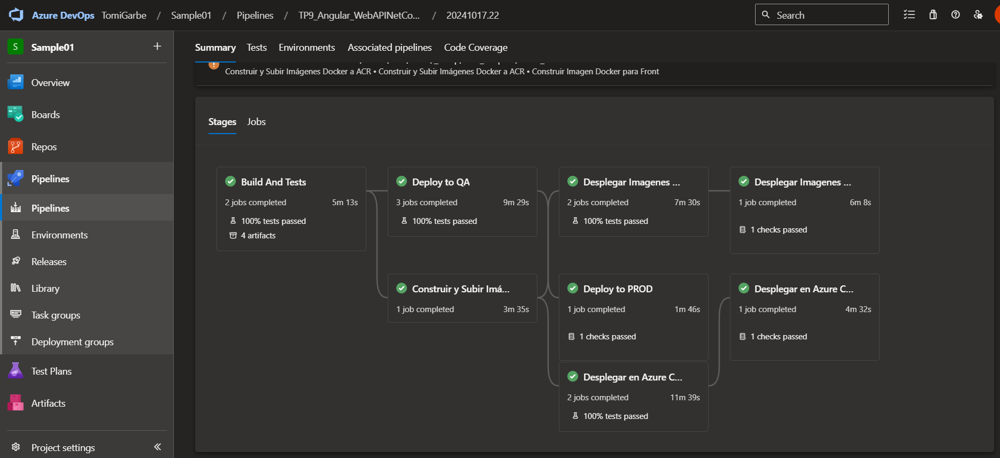

### 4- Desarrollo:

#### 4.1 Modificar nuestro pipeline para incluir el deploy en QA y PROD de Imagenes Docker en Servicio Azure App Services con Soporte para Contenedores
- Desarrollo del punto 4.1: 
	
  	- ##### 4.1.1 - Agregar a nuestro pipeline una nueva etapa que dependa de nuestra etapa de Construcción y Pruebas y de la etapa de Construcción de Imagenes Docker y subida a ACR realizada en el TP08
  	    
  	  - Agregar tareas para crear un recurso Azure Container Instances que levante un contenedor con nuestra imagen de back utilizando un AppServicePlan en Linux
  	  ```yaml
		#---------------------------------------
		### STAGE DEPLOY TO AZURE APP SERVICE QA
		#---------------------------------------
		- stage: DeployImagesToAppServiceQA
		  displayName: 'Desplegar Imagenes en Azure App Service (QA)'
		  dependsOn: 
		  - BuildAndTestBackAndFront
		  - DockerBuildAndPush
		  condition: succeeded()
		  jobs:
		    - job: DeployImagesToAppServiceQA
		      displayName: 'Desplegar Imagenes de API y Front en Azure App Service (QA)'
		      pool:
		        vmImage: 'ubuntu-latest'
		      steps:
		        #------------------------------------------------------
		        # DEPLOY DOCKER API IMAGE TO AZURE APP SERVICE (QA)
		        #------------------------------------------------------
		        - task: AzureCLI@2
		          displayName: 'Verificar y crear el recurso Azure App Service para API (QA) si no existe'
		          inputs:
		            azureSubscription: '$(ConnectedServiceName)'
		            scriptType: 'bash'
		            scriptLocation: 'inlineScript'
		            inlineScript: |
		              # Verificar si el App Service para la API ya existe
		              if ! az webapp list --query "[?name=='$(WebAppApiNameContainersQA)' && resourceGroup=='$(ResourceGroupName)'] | length(@)" -o tsv | grep -q '^1$'; then
		                echo "El App Service para API QA no existe. Creando..."
		                # Crear el App Service sin especificar la imagen del contenedor
		                az webapp create --resource-group $(ResourceGroupName) --plan $(AppServicePlanLinux) --name $(WebAppApiNameContainersQA) --deployment-container-image-name "nginx"  # Especifica una imagen temporal para permitir la creación
		              else
		                echo "El App Service para API QA ya existe. Actualizando la imagen..."
		              fi
		
		              # Configurar el App Service para usar Azure Container Registry (ACR)
		              az webapp config container set --name $(WebAppApiNameContainersQA) --resource-group $(ResourceGroupName) \
		                --container-image-name $(acrLoginServer)/$(backImageName):$(backImageTag) \
		                --container-registry-url https://$(acrLoginServer) \
		                --container-registry-user $(acrName) \
		                --container-registry-password $(az acr credential show --name $(acrName) --query "passwords[0].value" -o tsv)
		              # Establecer variables de entorno
		              az webapp config appsettings set --name $(WebAppApiNameContainersQA) --resource-group $(ResourceGroupName) \
		                --settings ConnectionStrings__DefaultConnection="$(cnn-string-qa)" \
	
  	  ```

	
	
	
	
	
   
#### 4.2 Desafíos:
- 4.2.1 Agregar tareas para generar Front en Azure App Service con Soporte para Contenedores


- 4.2.2 Agregar variables necesarias para el funcionamiento de la nueva etapa considerando que debe haber 2 entornos QA y PROD para Back y Front.


- 4.2.3 Agregar tareas para correr pruebas de integración en el entorno de QA de Back y Front creado en Azure App Services con Soporte para Contenedores. 


- 4.2.4 Agregar etapa que dependa de la etapa de Deploy en QA que genere un entorno de PROD.


- 4.2.5 Entregar un pipeline que incluya:

	El pipeline se encuentra en: https://dev.azure.com/TomiGarbe/Sample01/_build/results?buildId=355&view=results

	

  - A) Etapa Construcción y Pruebas Unitarias y Code Coverage Back y Front

	
	
  
  - B) Construcción de Imágenes Docker y subida a ACR

	

  - C) Deploy Back y Front en QA con pruebas de integración para Azure Web Apps

	

  - D) Deploy Back y Front en QA con pruebas de integración para ACI

	

  - E) Deploy Back y Front en QA con pruebas de integración para Azure Web Apps con Soporte para contenedores

	

  - F) Aprobación manual de QA para los puntos C,D,E

	
	
	
	

  - G) Deploy Back y Front en PROD para Azure Web Apps

	

  - H) Deploy Back y Front en PROD para ACI

	

  - I) Deploy Back y Front en PROD para Azure Web Apps con Soporte para contenedores

	
